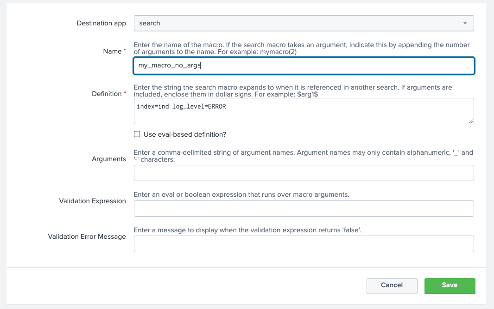
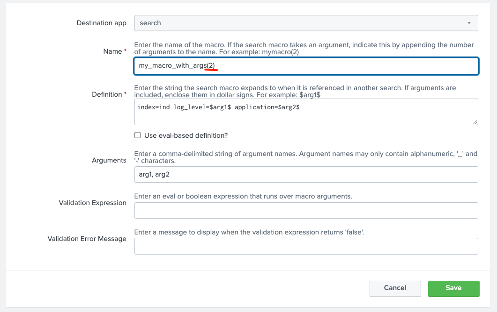

# Creating Search Macros
(32. Module 19A)  
(33. Module 19B)

### Topics
* Explain search macros
* Create macros with and without arguments
* Validate macro arguments
* Use and preview macros at search time
* Create and use nested macros
* Use macros with other knowledge objects

#### Explain search macros
Search macro is a knowledge object that will be reused.

Search macros are reusable chunks of Search Processing Language (SPL) that you can insert into other searches. Search macros can be any part of a search, such as an eval statement or search term, and do not need to be a complete command. You can also specify whether the macro field takes any arguments.

##### Advantages
* +Shortcuts*: Fast, saved off seaarhes to run ba naame
* Repatable: macros never changes unless you edit it
* Expandable: Command-Shift-E (for Mac)
* Run by name:
Run macros with the use of backticks (not single quotas): 
```
`macroname`
```

#### Create macros with and without arguments
Settings -> Advanced Search -> Search macros -> Clisk **Add new** to create one

In the opneded window you cna create macros with and without arguments:





Run macros with no arguments:
```
`my_macro`
```

Run macros with arguments:
```
`my_macro(INFO, my_App)`
```

TODO
### References
